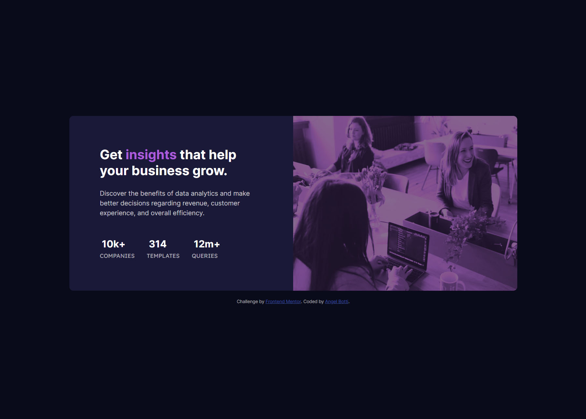
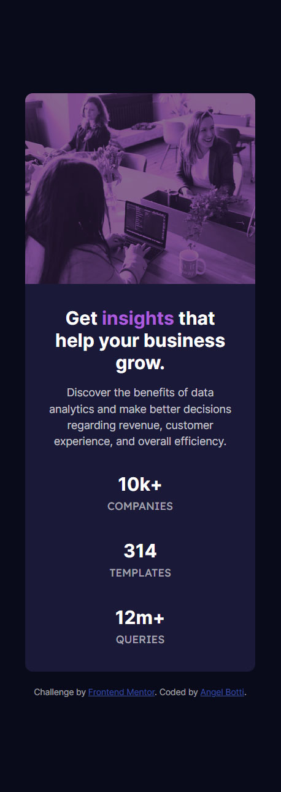

# Frontend Mentor - Stats preview card component solution

This is a solution to the [Stats preview card component challenge on Frontend Mentor](https://www.frontendmentor.io/challenges/stats-preview-card-component-8JqbgoU62). Frontend Mentor challenges help you improve your coding skills by building realistic projects.

## Table of contents

- [Overview](#overview)
  - [The challenge](#the-challenge)
  - [Screenshot](#screenshot)
  - [Links](#links)
- [Author](#author)

## Overview

### The challenge

Users should be able to:

- View the optimal layout depending on their device's screen size

### Screenshot

Desktop view

Mobile view

### Links

- Solution URL: [https://github.com/Botti13/Stats-preview-card-component](https://github.com/Botti13/Stats-preview-card-component)
- Live Site URL: [https://botti13.github.io/Stats-preview-card-component/](https://botti13.github.io/Stats-preview-card-component/)

## Author

- GitHub - [Botti13](https://github.com/Botti13)
- Frontend Mentor - [@Botti13](https://www.frontendmentor.io/profile/Botti13)
- LinkedIn - [Angel Botti](https://www.linkedin.com/in/angelbotti/)
